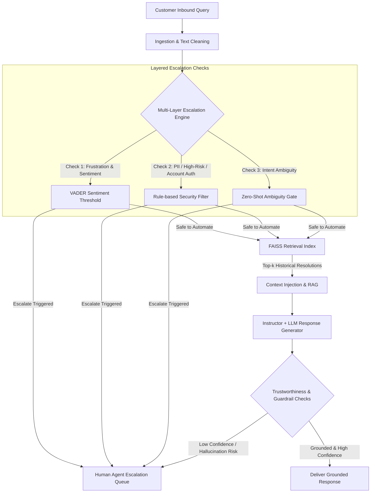

# Hiver Support Agent

[](https://www.python.org/downloads/)
[](LICENSE)
[](https://github.com/psf/black)

AI-powered customer support agent with RAG-grounded response generation, multi-layer escalation logic, and a trustworthiness-focused evaluation harness built against the Twitter Customer Support dataset.

---

## Table of Contents

- [Overview](#overview)
- [Architecture Overview](#architecture-overview)
- [Reproducibility Boundary & Quickstart](#reproducibility-boundary--quickstart)
- [Installation](#installation)
- [Usage](#usage)
- [Evaluation Approach](#evaluation-approach)
- [Makefile Target Reference](#makefile-target-reference)
- [Decision Log Reference](#decision-log-reference)

---

## Overview

Customer support at scale requires balancing rapid automated resolution with brand safety, factual groundedness, and timely escalation of high-risk or ambiguous inquiries. The **Hiver Support Agent** is designed to address this challenge directly on real-world customer support dialogue from the Twitter Customer Support dataset (spanning major brands such as Apple, Amazon, Uber, and Delta).

Key capabilities:
- **RAG-Grounded Retrieval:** Semantic vector search (FAISS + Dense Embeddings) indexing historical resolution dialogues and knowledge snippets.
- **Multi-Layer Escalation Logic:** Hybrid classification combining rule-based heuristics, sentiment/frustration signals (VADER), and LLM intent reasoning to route complex, volatile, or sensitive queries to human agents.
- **Trustworthiness & Guardrails:** Pydantic and Instructor-enforced schema validation to eliminate hallucinations and verify grounding before emission.
- **Tri-Tier Comparative Evaluation:** Comprehensive evaluation framework comparing naive/trivial heuristics, zero-shot simple LLM baselines, and the full multi-tier agent across calibration and evaluation splits.

---

## 📦 Assignment Deliverables Checklist

For the hiring review committee, all requested deliverables are immediately available here:
1. **Runnable Pipeline:** Follow the [Quick Start](#quick-start-under-15-minutes-benchmark) to reproduce headline results in < 15 minutes.
2. **Golden Evaluation Set (150-250 items):** Located in `data/golden/`. See [Sampling Notes](data/golden/README.md) for how it was stratified and labelled.
3. **Evaluation Harness:** Located in `src/eval/`. Includes automated metrics, McNemar's statistical testing, and an LLM-as-a-judge rubric (`llm_judge.py`).
4. **Final Report (max 6 pages):** Located at [`docs/report.md`](docs/report.md). Covers problem framing, failure analysis, baseline comparisons, and misleading metric disclosures.
5. **Decision Log:** Located at [`docs/DECISIONS.md`](docs/DECISIONS.md). Contains 15 non-obvious design decisions made during the build.

---

## Architecture Overview



### Key Components

1. **Data Preparation & Ingestion (`src/data_prep/`):**
   Normalizes, cleans, and reconstructs multi-turn conversational threads from raw Twitter support interactions.
2. **Stratified Sampling & Golden Set (`src/sampling/`):**
   Clusters customer issues across domains (tech, billing, shipping, general inquiry) to generate balanced calibration and evaluation sets.
3. **Retrieval Index (`src/agent/retrieval_index.py`):**
   Dense vector embeddings via `sentence-transformers` stored in FAISS for low-latency sub-millisecond nearest neighbor search.
4. **Agent Engine (`src/agent/`):**
   Executes escalation filters, context injection, and structured schema generation using `instructor` and `pydantic`.
5. **Evaluation Harness (`evaluate.py` & `src/eval/`):**
   Quantifies groundedness, escalation precision/recall, sentiment preservation, and response latency.

---

## Reproducibility Boundary & Quickstart

To ensure rigorous and transparent benchmarking, this project establishes an explicit **reproducibility boundary**:

| Phase | Scope | Execution Budget |
| :--- | :--- | :--- |
| **One-Time Untimed Setup** | Downloading dataset, text cleaning, stratified clustering, golden set compilation, FAISS index construction. | Untimed (one-time offline prep) |
| **Reproducibility Evaluation** | Running the comparative evaluation harness on the held-out evaluation split across all three models. | **< 15 minutes** (reproducible benchmark) |

### Quick Start (Under 15 Minutes Benchmark)

Once the one-time index is built, run the full comparative benchmark in a single command:

```bash
# Run the timed evaluation benchmark (< 15 mins)
make reproduce
```

Or invoke the script directly:
```bash
bash scripts/reproduce.sh 200
```

---

## Installation

### Prerequisites
- Python 3.10 or higher
- Git

### Steps

1. **Clone the repository:**
   ```bash
   git clone https://github.com/shinesh07/hiver-support-agent.git
   cd hiver-support-agent
   ```

2. **Create and activate a virtual environment:**
   ```bash
   python3 -m venv .venv
   source .venv/bin/activate
   ```

3. **Install pinned dependencies:**
   ```bash
   pip install -r requirements.txt
   ```
   *(Or run `make setup`)*

4. **Configure environment variables:**
   ```bash
   cp .env.example .env
   ```
   Edit `.env` and configure your keys:
   ```env
   OPENAI_API_KEY=sk-...
   OPENAI_MODEL_AGENT=gpt-4o-mini
   OPENAI_MODEL_JUDGE=gpt-4o
   KAGGLE_USERNAME=your_kaggle_username
   KAGGLE_KEY=your_kaggle_key
   SUBSAMPLE_N=200
   RANDOM_SEED=42
   ```

---

## Usage

### One-Time Pipeline Execution

Run the end-to-end data pipeline from raw data to retrieval index:

```bash
# 1. Download raw Twitter Customer Support dataset
make download

# 2. Clean and preprocess conversation threads
make clean

# 3. Cluster inquiries for stratified sampling
make cluster

# 4. Generate calibration and evaluation golden sets
make golden

# 5. Construct FAISS retrieval index
make index
```

### Running Evaluations

Run the comprehensive evaluation harness which compares the Trivial Baseline, the Simple Baseline, and the full Agent Pipeline across the evaluation set, computing McNemar's statistical significance tests:

```bash
python -m src.eval.run_eval
```

Run the threshold sweeper on the calibration set to optimize the Margin Band escalation thresholds using a shrinkage estimator:

```bash
python -m src.eval.threshold_sweep
```

---

## Evaluation Approach

The evaluation harness evaluates customer support interactions across three competing paradigms:

### Evaluated Model Tiers

1. **Trivial Baseline (`trivial`):**
   Deterministic rule-based model relying on keyword pattern matching and static canned responses. Serves as the lower baseline for response accuracy and escalation coverage.
2. **Simple Baseline (`simple`):**
   Standard ML baseline using k-NN for intent classification and Logistic Regression for escalation, fitted *only* on the calibration split to avoid train-test leakage.
3. **Full Agent (`agent`):**
   Full multi-tier system with hybrid escalation gates (Hard Regex -> Margin Band -> LLM Judge), FAISS semantic knowledge retrieval, context budgeting with graceful truncation, and structured generation.

### Trustworthiness Metrics

- **Groundedness & Context Adherence:** Degree to which response claims are supported by retrieved brand knowledge.
- **Escalation Recall (Ungrounded cases):** Explicit measurement of safety-critical escalation triggers when knowledge is missing.
- **Escalation Precision:** Accuracy in identifying inquiries requiring human intervention (severe frustration, account takeover, security-sensitive requests).
- **Statistical Rigor (McNemar's Test):** 95% Confidence Intervals comparing models on paired data.

### Calibration vs. Evaluation Splits

To prevent test-set contamination:
- **Calibration Split:** Used exclusively for tuning escalation thresholds, prompt engineering, and hyperparameter sweeps (`make sweep`).
- **Evaluation Split:** Strictly held-out test split reserved for the final benchmark report.

---

## Makefile Target Reference

| Target | Command | Description |
| :--- | :--- | :--- |
| `make setup` | `pip install -r requirements.txt` | Install all pinned dependencies |
| `make download` | `python scripts/download.py` | Download Twitter Customer Support dataset |
| `make clean` | `python -m src.data_prep.clean_text` | Clean and structure conversation logs |
| `make cluster` | `python -m src.sampling.cluster_for_stratification` | Compute semantic clusters for sampling |
| `make golden` | `python -m src.sampling.build_golden_set` | Build calibration and evaluation sets |
| `make index` | `python -m src.agent.retrieval_index build` | Build dense FAISS vector index |
| `make eval-trivial`| `python -m evaluate --model trivial --split evaluation` | Run trivial model evaluation |
| `make eval-simple` | `python -m evaluate --model simple --split evaluation` | Run simple LLM baseline evaluation |
| `make eval-agent` | `python -m evaluate --model agent --split evaluation` | Run full agent evaluation |
| `make eval-all` | Runs all three evaluations | Execute comparative evaluation suite |
| `make sweep` | `python -m src.eval.threshold_sweep` | Run hyperparameter sweep on calibration split |
| `make reproduce` | `bash scripts/reproduce.sh` | Run timed <15 min benchmark across all models |
| `make test` | `pytest tests/ -v` | Execute automated test suite |

---

## Decision Log Reference

For in-depth architectural rationale and trade-off analyses, refer to the project documentation:
- **Vector Search Engine:** Chosen FAISS-CPU with `sentence-transformers` for millisecond-latency local retrieval without third-party cloud database dependencies.
- **Escalation Gate Architecture:** Multi-layered cascading filters (sentiment + rule-based security + LLM confidence) to minimize false negatives on urgent customer queries.
- **Structured Outputs via Instructor:** Enforcing strict Pydantic schemas on agent responses to guarantee programmatic parseability and eliminate out-of-format generation.
- **Calibration Split Separation:** Reserving an isolated calibration dataset for parameter sweeps to prevent data leakage into the evaluation benchmark.
